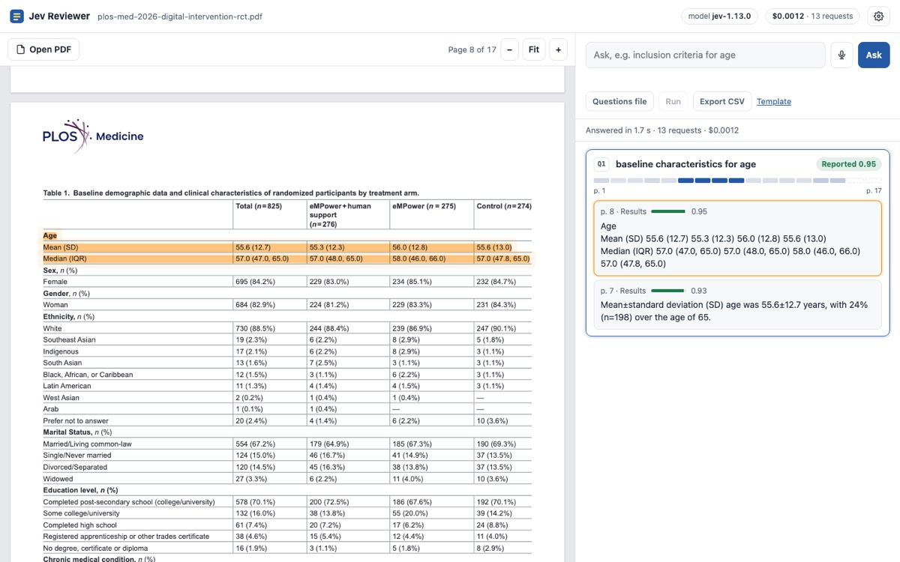

# Jev Reviewer

Open a PDF of a medical paper in Chrome, then ask it for what your systematic review
extraction form needs: *inclusion criteria for age*, *baseline age*, *how many were randomized*,
*who funded it*. Ask by voice, by typing, or with a CSV/TXT file of questions. Every answer is a
**verbatim excerpt** with its page number, highlighted in the paper, and the whole sheet exports
to CSV.

The model is **Jev** (TypeSafe's System One model, `jev-1.13.0`). Jev never writes text: it
answers typed questions with probabilities. Here it only points at line ids, and code copies the
excerpt out of the PDF. Nothing is paraphrased, so nothing can be invented.



## How it works

```
 PDF (pdf.js, in the browser)        segment.js                         jev.js
 ─────────────────────────────       ─────────────────────────────      ──────────────────────────────────────
 text items with positions    ──▶    lines ─▶ paragraphs ─▶ sentences   pass 1, screen: one request per page chunk,
                                     table rows kept one per line        every question at once:
                                     running headers dropped               Choice "which line answers q?" (+ none)
                                     hyphens rejoined when safe            Noul   "does this passage answer q?"
                                     reference list flagged           ─▶ pass 2, verify: per question, the best
                                     ids L001..L610 + page rects           lines and their neighbors, one Noul each:
                                                                           "does line L085 itself answer q?"
                                                                         code: excerpts = lines with Noul ≥ 0.5,
                                                                         adjacent lines merged, table label added
```

* **Select, don't generate.** Candidate spans come from the PDF; Jev picks ids; the excerpt is
  copied verbatim with page, section, and highlight rectangles.
* **Speculative fan-out.** Each screening request carries every question against the same page
  text, so the 18-question template costs $0.008 and 6 seconds in one batch, against roughly
  $0.02 and 27 seconds asked one at a time (extrapolated from the single-question run).
* **Two kinds of judgment.** The screening Choice is relative (which line, if any). The verifying
  Nouls are absolute (does this line answer), which is what multi-row answers such as
  "Mean (SD)" and "Median (IQR)" under "Age" need.
* **Not reported is an answer.** When no line passes, the card says *Not found* (or *Unclear*,
  with the closest lines) instead of guessing. The strip under each question shows how likely
  each page was to hold the answer.
* **Voice** uses the browser's speech recognition. Each finished phrase becomes a question; a
  small Jev check (`is_request`, 0.59 to 0.98 for questions, about 0.01 for side talk) drops
  chatter such as "hmm let me see". Say **next** or **previous** to step through excerpts.

All question texts and thresholds live in [`docs/jev.js`](docs/jev.js), in one place, like the
`constants.js` of [jev-voice-browser](https://github.com/moritzkremb/jev-voice-browser).

### Compared with jev-voice-browser

Both keep code in control and ask Jev narrow, typed questions. The voice browser acts on partial
speech (intent, target element, "is the command complete?") and drives Playwright. Here the unit
of work is a finished question, so the partial-transcript machinery is left out; the hard part
is instead reading a paper well enough that every excerpt is a clean sentence or table row.

## Run it on your computer

Requirements: Node 20 or newer. Chrome or Edge for voice.

```bash
git clone https://github.com/choxos/jev-reviewer.git
cd jev-reviewer
cp .env.example .env          # paste your key from https://console.typesafe.ai/keys
npm start                     # http://localhost:8787
npm start -- path/to/paper.pdf   # opens that paper on start
```

The server has no dependencies. It serves the app from `docs/` and relays requests to TypeSafe
with the key from `.env`, so the key never reaches the browser. It listens on `127.0.0.1` only
and refuses requests from origins and hosts it does not know.

## Use it online

* **https://jevreviewer.xera.ac**: the full app with its relay.
* **https://choxos.github.io/jev-reviewer/**: the same page from GitHub Pages (published from
  `docs/`), sending its questions to the relay on jevreviewer.xera.ac.

No key is needed on either. PDFs are read in the browser and never uploaded; only the extracted
text and your questions go to TypeSafe.

The TypeSafe API does not accept requests straight from web pages (it rejects browser origins),
so both pages go through `server.js`, which adds a shared TypeSafe key on the server. The key
never reaches the browser. To keep a public key affordable, each address can send only so many requests
a second (enough for a batch), and the server stops spending the shared key
after `DAILY_TOKEN_BUDGET` input tokens per day. A visitor who pastes their own key in
**Settings** uses their own quota and is not capped.

### Deploying on the server

The layout: a checkout in `<app folder>`, nginx serving
`docs/` directly, and pm2 running the relay on `127.0.0.1:<port>`.

```bash
# as <deploy user>
git clone https://github.com/choxos/jev-reviewer.git <app folder>
cd <app folder>
cp .env.example .env    # set TYPESAFE_API_KEY, PORT=<port>,
                        # ALLOWED_ORIGINS=https://jevreviewer.xera.ac,https://choxos.github.io,
                        # DAILY_TOKEN_BUDGET=<budget>
./deploy/deploy.sh      # npm ci, tests, pm2 start or restart, pm2 save

# once, as root: enable the vhost and get a certificate
sudo bash <app folder>/deploy/install.sh
```

Updates: `cd <app folder> && git pull && ./deploy/deploy.sh`.

## Questions files

* **CSV** with a header: a `question` (or `query`) column, optionally an `id` column.
  [`docs/samples/questions-template.csv`](docs/samples/questions-template.csv) has 18 common
  items (design, age criteria, baseline age and sex, arms, outcomes, follow-up, risk of bias
  items, funding, registration).
* **CSV** without a header: `id,question` rows.
* **TXT**: one question per line; lines starting with `#` are comments.

**Export CSV** writes one row per excerpt, best first: `file, id, question, verdict, best_score,
page, section, excerpt, excerpt_score, line_ids`. A question with nothing found gets one row with
an empty excerpt, so the sheet always has every item.

## Tests and measurements

```bash
npm install          # dev only: pdfjs-dist for the Node tests
npm test             # segmenter on the sample paper, request building, policy, CSV, server and relay
npm run live         # real API: 9 questions on the sample paper (about $0.005)
npm run live -- other.pdf --questions my-form.csv --debug
```

Measured on the sample paper (17 pages, 610 lines) in September 2026:

| run | requests | time | cost |
| --- | --- | --- | --- |
| 1 question | 13 | 1.5 s | $0.0012 |
| 9 questions | 20 | 3.4 s | $0.0044 |
| 18 questions (template) | 30 | 5.6 s | $0.0083 |

On the sample and on a two-column BMC Medicine trial, the age criterion, baseline age (text and
Table 1 rows), randomization, primary outcome, funding, doses, and the blinded adjudication panel
came back as the top excerpts; "dose of metformin" came back *Not found*, and "were outcome
assessors blinded?" on the open-label trial came back *Unclear* with "open-label" as the closest
line. Treat these as spot checks, not a validation study: check excerpts against the paper
before they enter your review.

## Limits

* Scanned PDFs have no text layer: run OCR first (the app warns when it finds almost no text).
* Figures are images, so their contents are not searched; captions are.
* Text order follows the PDF's content stream, which is reading order in publisher PDFs
  (checked on single and two-column layouts). Unusual layouts can merge or split sentences.
* English works best. Thresholds were tuned on `jev-1.13.0`; re-check them if you move the
  model version.
* In Chrome, speech recognition sends audio to Google.

## Layout

```
docs/index.html     the app page (GitHub Pages serves docs/)
docs/app.js         viewer, highlights, questions by voice / text / file, results, export
docs/segment.js     PDF text to sentences and table rows with page rectangles
docs/jev.js         questions, thresholds, two-pass requests, result policy, CSV in and out
docs/samples/       sample trial (CC BY 4.0) and the questions template
server.js           app server and TypeSafe relay, local or on the server (no dependencies)
deploy/             nginx vhost, deploy and one-time root install scripts for jevreviewer.xera.ac
test/               node --test suites and the live check
```

The sample paper is Johnson E, Hyde A, Corrick S, et al. (2026) *Effect of a digital intervention
on mental health symptoms in adults with chronic conditions: A three-arm randomized controlled
trial.* PLoS Med 23(8): e1005198, [doi:10.1371/journal.pmed.1005198](https://doi.org/10.1371/journal.pmed.1005198),
published under [CC BY 4.0](https://creativecommons.org/licenses/by/4.0/).

MIT license.
