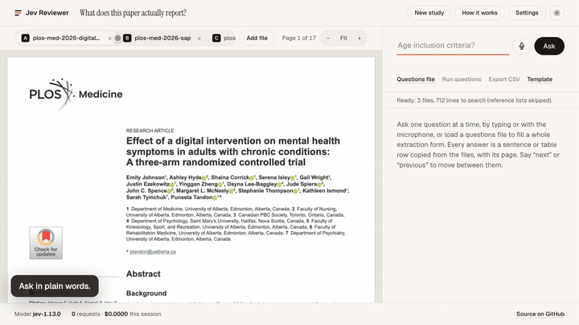
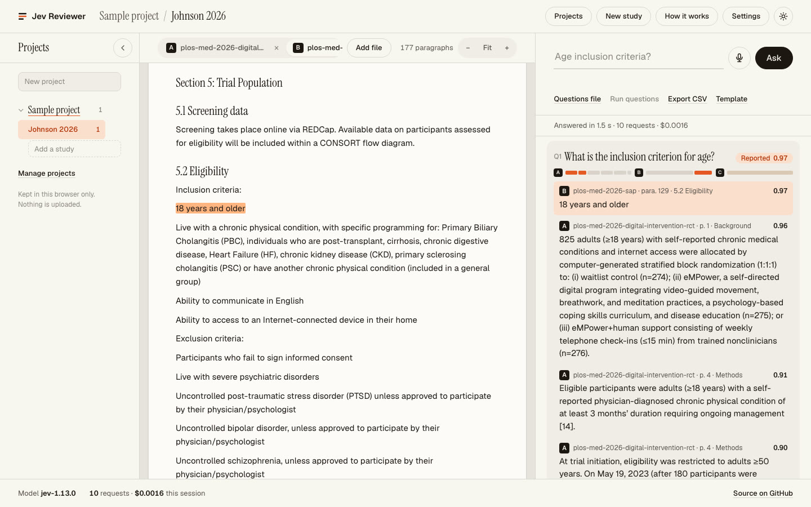

# Jev Reviewer

Open a trial report in Chrome together with its supplements, protocol, analysis plan or data
tables, then ask for what your systematic review extraction form needs: *inclusion criteria for
age*, *baseline age*, *how many were randomized*, *who funded it*. Ask by voice, by typing, or with
a questions file (CSV, TXT or a spreadsheet) or a ready-made template (trial characteristics,
RoB 2, ROBINS-I, QUADAS-2, TIDieR). Every answer is a **verbatim quote** with its file and page,
paragraph, row or slide, highlighted where it sits. You check each one, write the value for your
form beside it and tick it; the **extraction table** shows every study against every question, and
exports one row per study or one row per quote.

Files can be PDF, Word (.docx, .doc), Excel (.xlsx, .xls), PowerPoint (.pptx), OpenDocument
(.odt, .ods, .odp), RTF, saved web pages (.html), CSV, TSV, plain text or Markdown. Work is kept
as **projects** that hold **studies**, and studies hold their files and answers, all stored in your
browser: nothing is uploaded or kept on a server. A project's studies can be **imported from a
reference manager** (EndNote, Zotero, Mendeley) or a database export (PubMed, Scopus, Web of
Science, Covidence, Rayyan), with their PDFs, and its questions **answered in every study** at once.

**Use it at [jevreviewer.xera.ac](https://jevreviewer.xera.ac)** or
[choxos.github.io/jev-reviewer](https://choxos.github.io/jev-reviewer/). No key, no install.
[The guide](https://jevreviewer.xera.ac/guide/) walks through a whole review.



<sub>The first question of the tour. [Watch the full tour](documentation/tour.mp4) at 1080p, silent with captions: a three-file study, a quote from a Word supplement, a Table 1 answer with its row label, an 18-question extraction form in five seconds, a question the files do not answer, the CSV export, the projects sheet and the dark theme.</sub>

The model is **Jev** (TypeSafe's System One model, `jev-1.13.0`). Jev never writes text: it
answers typed questions with probabilities. Here it only points at line ids, and code copies the
quote out of the file. Nothing is paraphrased, so nothing can be invented.



## How it works

```
 files, read in the browser          segment.js                         jev.js
 ─────────────────────────────       ─────────────────────────────      ──────────────────────────────────────
 PDF (pdf.js): text with places ──▶  sentences and table rows           pass 1, screen: one request per chunk of
 Word, OpenDocument, RTF, web        running headers dropped            2 or 3 pages of one file, all questions
   pages, text: paragraphs, tables   hyphens rejoined when safe           Choice "which line answers q?" (+ none)
 Excel, CSV: rows by sheet           reference lists flagged              Noul   "does this passage answer q?"
 PowerPoint: slide by slide          ids by file: A001, B001, C001   ─▶ pass 2, verify: per question, the best
 (textfile.js, office.js)                                                lines and their neighbors, one Noul each:
                                                                         "does line B129 itself answer q?"
                                                                         code: quotes = lines with Noul ≥ 0.5,
                                                                         adjacent lines merged, table label added
```

* **A study is several files.** The article, its appendix, the protocol, the statistical
  analysis plan, the data tables, a conference slide deck. Each file gets a letter that starts its
  line ids, every question is asked of every file, and each quote says which file it came from.
  The sample study is a PLoS Medicine trial with its analysis plan and CONSORT checklist, both
  Word files.
* **Every format gives the same thing: blocks.** Paragraphs, headings and table rows in reading
  order, whatever the file. A spreadsheet row keeps its row number and shows its cells as the
  spreadsheet does (percentages, decimals, dates); a slide's text keeps its slide number. Files
  are read by their content, so a `.doc` that is really RTF or a saved web page still opens. There
  are no libraries for this: `.docx`, `.xlsx`, `.pptx` and OpenDocument files are zip files read
  with the browser's own decompression, `.doc` and `.xls` are read from their binary formats in
  [`docs/office.js`](docs/office.js), and web pages with the browser's HTML parser.
* **Select, don't generate.** Candidate lines come from the files; Jev picks ids; the quote is
  copied verbatim with file, page or paragraph, section, and its place to highlight.
* **Speculative fan-out.** Each screening request carries every question against the same text,
  so the 18-question template costs about a cent and five seconds over three files.
* **Two kinds of judgment.** The screening Choice is relative (which line, if any). The verifying
  Nouls are absolute (does this line answer), which is what multi-row answers such as
  "Mean (SD)" and "Median (IQR)" under "Age" need.
* **Not reported is an answer.** When no line passes, the card says *Not found* (or *Unclear*,
  with the closest lines) instead of guessing. The strip under each question shows, file by file,
  how likely each stretch was to hold the answer; click it to go there.
* **Projects, studies, files and answers stay in your browser.** A project holds studies; a
  study holds its files, its answers and their highlights. The column on the left lists every
  project with its studies: pick one to open it, add a study or a project there, delete one with
  its × (pressed twice), or fold the column to a rail for more room. Come back later and the
  study you left opens again, at the file you were reading, with its answers. If an improved
  reader splits a file differently, saved quotes are found again by their exact text; one that no
  longer matches word for word stays, grayed, instead of being lost. Any saved answer can be
  deleted with its own × (pressed twice).
* **A project is a review.** Its questions belong to the project. **Ask: Every study** (in the
  panel; **Ask in every study** in the column and the projects sheet; **Ask the missing answers**
  in the extraction table) asks each study only what it still lacks: questions it never answered,
  questions reworded since, and every question when a file was added after the answer (about a
  cent a study for 18 questions). **Ask: This study** does the same for the open study, and **Ask
  again** redoes one answer. An answer you have checked or
  annotated is never overwritten by a reworded question: it stays, under a new id, beside the new
  one.
* **You check every answer.** Every quote has three small buttons. The green **tick** checks it
  as the question's answer: it turns green, it becomes your answer (shown under the quotes; words
  you wrote yourself stay), and the other quotes fold away behind **Show N other answers**. The
  **pencil** opens a quote's words in the editor for your answer, where **Done** or Escape closes
  it and **Cancel** puts back what was there; your answer has its own pencil, and **Write an
  answer** starts one from scratch. The **squares** copy a quote with its file and place. The quotes themselves stay verbatim, since they are the evidence; your answer is
  what you edit. The **Check** button under a question checks it as it stands, for example when
  the files do not report it. The panel counts answers and checked ones, and the column shows
  `checked/answers` per study, with a green tick once a study is done. **Find** looks up exact
  words in the files at once, without Jev, to check an answer or a *Not found*. Keys speed this
  up when no field is being typed in: `j` and `k` move between answers, `c` checks, `e` edits the
  answer, `n` goes to the next one not yet checked, `/` goes to the question box; once every
  answer is checked, the next study to check is one press away.
* **The extraction table** shows a project's studies down and its questions across, each cell the
  answer's verdict, green with a tick once checked and hatched when it is due to be asked again; a cell opens
  the study at that answer. It exports **the table** (one row per study: its reference, how many
  answers are checked, and each question's value and quotes) and **the quotes** (one row per
  quote), and backs the project up.
* **Eligibility and notes.** The bar under a study's file tabs shows its reference (with DOI and
  PubMed links), a **Note** for things to remember (a companion report, a question sent to the
  authors), and **Exclude**, which asks for a reason (the usual ones are offered, and the
  project's own). An excluded study stays, struck through: runs skip it, the extraction table
  lists it apart and counts the PRISMA flow (full reports assessed, excluded with reasons,
  included), and the exports carry the reason and the note.
* **Risk of bias.** **Risk of bias**, under a study's file tabs, judges each domain of the
  project's tool (RoB 2, ROBINS-I or QUADAS-2), with your answers to the domain's template
  questions beside it (a press opens the study at one) and a line for the support for each
  judgment. The overall judgment is suggested from the most serious domain until you set it. The
  extraction table shows the judgments as a traffic-light grid and exports them in the table
  [robvis](https://github.com/mcguinlu/robvis) draws its figures from (`Study, D1..., Overall,
  Weight`); backups keep them.
* **A second reviewer.** For independent double extraction, the extraction table's **Send a copy
  to extract independently** saves the project without your answers, ticks, exclusions and notes.
  The second reviewer restores it in their browser, extracts, and sends back a backup; restored
  here, **Compare with** matches the studies (by DOI, PubMed id or name) and lists every answer
  that differs, every answer only one of you gave, and every study one of you excluded, with the
  agreement to report (such as "212 of 240 answers agree, 88%"). **Use theirs** takes their
  answer, **Open** goes to the study.
* **Question lists grow in the app.** A question typed into one study can join the project's list
  with **Add to the project's questions**. In the panel's list, pressing a question's wording
  changes it in place (studies that answered the old wording are asked again on the next run), ↑
  and ↓ reorder it (the order is the extraction table's), × removes it, and the list downloads as
  CSV, to share with a second reviewer.
* **Not applicable.** A question that does not apply to a study (blinding in an open-label trial,
  say) is marked **Not applicable** under its answer: it counts as checked, reads "n/a" in the
  extraction table and "Not applicable" in the exports, and is never asked again.
* **Numbers in the quotes.** The answer editor lists the numbers found in the checked quote (or
  in every quote), citation marks left out; one press puts a number in the answer at the cursor,
  for outcome data such as `55.6 (12.7)`.
* **Importing references.** **Import references** (in the column, the projects sheet, or on the
  empty desk) takes a reference list with its files: RIS, BibTeX, EndNote XML or tagged `.enw`,
  PubMed (`.nbib`), Web of Science, CSL JSON, or CSV and Excel with a title column. Pick the list
  together with its PDFs, a zip of them, or the folder the reference manager exported. Each
  reference becomes a study named as reviews cite it (`Smith 2024`, then `Smith 2024b`); files find
  their reference by the attachment names the list records, then by the DOI, the title's first
  words, or the first author and year in their own names. A preview says what was found and what
  matched before anything is created; references already in the project are left alone, except
  that one imported earlier without its files gets the files matched to it now (import the list
  first, add the PDFs once you have them). Abstracts come in from every format; a reference that
  arrives without its full text gets its abstract as a small text file (`Park 2022 abstract.txt`),
  so the study can be asked about until the full text comes, and every quote from it says so. The
  bar under the file tabs shows the abstract on request, and once a project has eight studies or
  more, the column offers **Find a study** by name, title or author. The code
  is [`docs/references.js`](docs/references.js). In EndNote, export the library as XML or RIS and
  add its `.Data/PDF` folder; in Zotero, export the collection as BibTeX or RIS with its files.
* **Backups.** Everything lives in the browser's IndexedDB ([`docs/library.js`](docs/library.js)),
  on this device, for this site. **Back up the project** (in the column, the extraction table and
  the projects sheet) writes it to one zip file with its studies, files, answers, values and
  checks, plus its two extraction sheets as CSV to read without the app
  ([`docs/backup.js`](docs/backup.js)); **Back up all projects** does every project, and
  **Restore a backup** adds them back as new projects, in this browser or another one. The sheet
  also says how much storage the site uses, and the column says when the open project was last
  backed up (louder when it never was, or changed a week or more since). When the browser's
  storage for the site is full, the app says so and keeps the work on screen instead of losing it
  quietly; a file it cannot keep is not added. A study open in two tabs stays in step: a change in
  one shows in the other, which never saves an older copy over it.
* **What it cost.** The band at the bottom counts requests and dollars this session and in all
  (in this browser), and each project keeps its own total, shown in its extraction table and kept
  in its backups: the number a methods section or a budget asks for.
* **Voice** uses the browser's speech recognition. Each finished phrase becomes a question; a
  small Jev check (`is_request`, 0.59 to 0.98 for questions, about 0.01 for side talk) drops
  chatter such as "hmm let me see". Say **next** or **previous** to step through quotes.

All question texts and thresholds live in [`docs/jev.js`](docs/jev.js), in one place, like the
`constants.js` of [jev-voice-browser](https://github.com/moritzkremb/jev-voice-browser). Both keep
code in control and ask Jev narrow, typed questions; the voice browser acts on partial speech and
drives Playwright, while here the hard part is reading papers well enough that every quote is a
clean sentence or table row.

## Run it on your computer

Requirements: Node 20 or newer. Chrome or Edge for voice.

```bash
git clone https://github.com/choxos/jev-reviewer.git
cd jev-reviewer
cp .env.example .env              # paste your key from https://console.typesafe.ai/keys
npm start                         # http://localhost:8787
npm start -- path/to/paper.pdf    # opens that paper on start
```

The server has no dependencies. It serves the app from `docs/` and relays requests to TypeSafe
with the key from `.env`, so the key never reaches the browser. It listens on `127.0.0.1` only
and refuses requests from origins and hosts it does not know. Open several files at once with
**Choose files**, add more with **Add file**, or drop them on the page.

## The hosted copies

* **https://jevreviewer.xera.ac**: the full app with its relay.
* **https://choxos.github.io/jev-reviewer/**: the same page from GitHub Pages (published from
  `docs/`), sending its questions to the relay on jevreviewer.xera.ac.

Files are read in the browser and never uploaded; only their text and your questions go to TypeSafe.
Projects are saved in the browser you use, per site: the two copies keep separate projects, and
clearing the site's data deletes them. The hosted copies count visits with Google Analytics
([`docs/analytics.js`](docs/analytics.js)): page views only, with a fixed page title and address, so
no study name, file address, file or question reaches it. It is not loaded on localhost or in
automated browsers. The TypeSafe API does not accept requests straight from web pages, so both pages
go through `server.js`, which adds a shared TypeSafe key on the server. To keep a public key
affordable, each address can send only so many requests a second (enough for a batch), and the
server stops spending the shared key after `DAILY_TOKEN_BUDGET` input tokens per day. A visitor who
pastes their own key in **Settings** uses their own quota and is not capped.

### Hosting your own copy

`server.js` is the whole back end. Run it with a TypeSafe key in `.env` (see
[`.env.example`](.env.example)) behind any HTTPS reverse proxy, and list the sites allowed to use
it as their relay in `ALLOWED_ORIGINS`.

## Questions files

**Upload a list** in the panel's Questions row (or **Upload questions** in a project's row in the
projects sheet or the column) takes any of these, and **Replace the list** swaps it for another;
the panel lists the project's questions, **Ask: This study** asks the open study what it lacks,
and **Ask: Every study** asks every study of the project.

**Templates** adds a ready-made list to the project (questions already on it stay once), or
downloads it to edit. Each asks for the quotes a reviewer needs, in plain words; the judgments
stay yours.

| template | questions | file |
| --- | --- | --- |
| Trial characteristics | 18: design, setting, age criteria, inclusion and exclusion criteria, number randomized, baseline age and sex, intervention, comparator, primary outcome, follow-up, sequence generation, allocation concealment, blinding, attrition, funding, registration | [`questions-template.csv`](docs/samples/questions-template.csv) |
| Risk of bias in randomized trials (RoB 2) | 14, by domain: randomization, deviations from the intended interventions, missing outcome data, measurement of the outcome, selection of the reported result | [`questions-rob2.csv`](docs/samples/questions-rob2.csv) |
| Risk of bias in non-randomized studies (ROBINS-I) | 10: confounding, selection, classification of interventions, deviations, missing data, measurement, reporting | [`questions-robins-i.csv`](docs/samples/questions-robins-i.csv) |
| Diagnostic accuracy (QUADAS-2) | 12: patient selection, index test, reference standard, flow and timing | [`questions-quadas2.csv`](docs/samples/questions-quadas2.csv) |
| Intervention description (TIDieR) | 12: what, why, materials, procedures, who, how, where, when and how much, tailoring, modifications, fidelity, comparator | [`questions-tidier.csv`](docs/samples/questions-tidier.csv) |
| Outcome data for meta-analysis | 10: time points, the measure and its direction, numbers analyzed, means and standard deviations, medians, change or final values, events, the effect with its confidence interval, adjustment, clustering | [`questions-outcomes.csv`](docs/samples/questions-outcomes.csv) |

Your other projects' lists are offered there too, to start a new review from an old form.

* **CSV** with a header: a `question` (or `query`) column, optionally an `id` column. An id
  given twice becomes `age`, `age_2`, so two questions never share their answers.
* **CSV** without a header: `id,question` rows.
* **A spreadsheet** (.xlsx, .xls, .ods, .tsv): its first sheet, read like a CSV, so an extraction
  form kept in Excel loads as it is.
* **TXT**: one question per line; lines starting with `#` are comments.

A questions file is kept with the project, for all its studies.

**Export CSV** in the panel writes the open study's answers, one row per quote, best first:
`study, id, question, verdict, best_score, file, location, section, excerpt, excerpt_score,
line_ids, checked_quote, checked, note, asked_on, model`, then the study's reference (`authors, year,
title, journal, doi, pmid`), empty for a study not imported from a reference list. `location`
reads `p. 4` in a PDF, `para. 129` in a Word or text file, `row 12` in a spreadsheet and `slide 3`
in a slide deck; `checked_quote` marks the quote you checked as the answer; `checked` and `note`
(your answer) are yours; `asked_on` and `model` say when and with which Jev version the answer was
found. A question with nothing found gets one row with an empty excerpt, so the sheet always has
every item. The extraction table's **Export quotes** writes the same sheet for every study of the
project, and **Export table** writes one row per study: `study`, its reference, `checked` (such
as `12 of 18`), then for each question your answer and its quotes (only the checked one, once you
checked it). The files carry a byte order mark, so Excel reads them as UTF-8 (quotes are full of ≥,
± and µ).

## Tests, measurements and the tour

```bash
npm install          # dev only: pdfjs-dist for the tests, playwright-core for the tour
npm test             # segmenter, every file format, reference lists, requests, policy, CSV, backups, server and relay
npm run live         # real API: 9 questions on the sample study (about half a cent)
npm run live -- paper.pdf supplement.docx --questions my-form.csv --debug
npm run tour -- https://jevreviewer.xera.ac   # writes documentation/tour.mp4 and tour.gif
```

Measured on the sample study (a 17-page article PDF, its 12-page analysis plan and its CONSORT
checklist, 712 lines to search) in September 2026:

| run | requests | time | cost |
| --- | --- | --- | --- |
| 1 question | 10 | 1.2 to 2 s | $0.0016 |
| 9 questions | 17 | 2.3 s | $0.0052 |
| 18 questions (template) | 27 | 4.6 s | $0.0101 |

Screening chunks of 12,000 characters gave the same answers as chunks of 7,000 with a third
fewer requests. Across the sample study, the age criterion (the article and the analysis plan's
"18 years and older"), baseline age (text and Table 1 rows), sample size and missing data (the
analysis plan and the article), randomization, primary outcome and funding came back as the top
quotes; the CONSORT checklist item that points to the missing-data paragraph came back too;
"dose of metformin" came back *Not found*. Treat these as spot checks, not a validation study:
check quotes against the files before they enter your review.

The file readers are tested on [`test/fixtures`](test/fixtures): one report, one workbook and one
slide deck, each written by LibreOffice as .docx, .doc, .odt, .rtf, .xlsx, .xls, .ods, .pptx and
.odp (and by macOS as .doc and .rtf), must all give the same blocks, with footnotes, tracked
deletions and field codes left out and numbers shown as their cells show them.

The tour is recorded by [`record-tour.mjs`](record-tour.mjs) against the live site, so every
answer in it is one the app gives. Playwright drives Chrome at a device scale of 1.5, which draws
the 1280 by 720 layout with 1920 by 1080 real pixels, and a Chrome screencast saves each frame as
it is painted; ffmpeg joins the frames with their own timing. Headless Chrome has no pointer and
no microphone, so the recorder draws a pointer and captions; voice is mentioned, not shown. It
warns and exits with status 1 when a step does not happen: a question that never comes back, a
best quote from the wrong file, a Table 1 answer without its rows, a template run that is not 18
of 18, a CSV with too few rows, or a projects sheet without the study.

## Design

The page follows the design of [game-of-life](https://github.com/choxos/game-of-life): warm oat
paper, one vermilion accent, Instrument Serif for headings, Geist for everything else, pill
controls and a thin data band at the bottom. It follows the system's light or dark
theme until you pick one with the switch in the header. All colors and fonts are tokens in
[`docs/tokens.css`](docs/tokens.css); the fonts are served from `docs/fonts` under the SIL Open
Font License.

## Limits

* Scanned PDFs have no text layer: run OCR first (the app warns when it finds almost no text).
* Figures are images, so their contents are not searched; captions are. Images, charts and
  equations in Office files are skipped too, and so are speaker notes.
* Not read: PowerPoint 97-2003 (.ppt), Word and Excel 95 or older, password-protected files
  (save an unprotected copy, or a PDF). A spreadsheet is read up to 5,000 rows. Number formats
  are applied without their literal text, so `54.2 kg` in a cell formatted `0.0 "kg"` reads `54.2`.
* A web page is read from its main content and its first heading on; the Node scripts
  (`npm run live`) read every format but web pages, which need the browser's parser.
* An EndNote library file (`.enl`) is not read directly: export it as XML or RIS. A reference
  list's attachment paths only help to match files; the files themselves have to be picked, since
  a web page cannot open paths on the computer.
* Projects live in one browser on one device. Clearing the site's data, or a private window,
  loses them: download a backup to keep them, or to move them to another browser or site.
* PDF text order follows the file's content stream, which is reading order in publisher PDFs
  (checked on single and two-column layouts). Unusual layouts can merge or split sentences.
* English works best. Thresholds were tuned on `jev-1.13.0`; re-check them if you move the
  model version.
* In Chrome, speech recognition sends audio to Google.

## Layout

```
docs/index.html      the page (GitHub Pages serves docs/)
docs/guide/          the guide: a whole review in Jev Reviewer, for readers and search engines
docs/robots.txt      with sitemap.xml, manifest.json and the icons, what search engines and
                     phones read about the site
docs/app.js          projects and studies, viewer, highlights, questions by voice, text or file, export
docs/library.js      projects, studies, files and answers in the browser's IndexedDB
docs/backup.js       backups: projects with their files in one zip, and restoring them
docs/references.js   reference lists (RIS, BibTeX, EndNote, PubMed, Web of Science, CSL JSON,
                     tables) and matching the files that come with them
docs/segment.js      PDF text and other files' blocks to sentences and table rows, with places
docs/textfile.js     every format but PDF as blocks: zip-based Office and OpenDocument files,
                     RTF, web pages, CSV and TSV, text and Markdown
docs/office.js       Word 97-2003 (.doc) and Excel 97-2003 (.xls), and spreadsheet number formats
docs/jev.js          questions, thresholds, two-pass requests, result policy, which answers a
                     study still lacks, CSV in and out
docs/tokens.css      colors, fonts, spacing, motion; docs/styles.css uses only these
docs/theme.js        the light and dark switch, and the projects column's first state
docs/analytics.js    Google Analytics page views on the hosted copies
docs/samples/        the sample study (CC BY 4.0) and the question templates
server.js            app server and TypeSafe relay, local or on the server (no dependencies)
record-tour.mjs      the tour recorder; documentation/ holds its video, gif and the screenshot
test/                node --test suites, their fixtures, and the live check
```

The sample study is Johnson E, Hyde A, Corrick S, et al. (2026) *Effect of a digital
intervention on mental health symptoms in adults with chronic conditions: A three-arm randomized
controlled trial.* PLoS Med 23(8): e1005198,
[doi:10.1371/journal.pmed.1005198](https://doi.org/10.1371/journal.pmed.1005198), with its S1
File (statistical analysis plan) and S1 Checklist (CONSORT 2025, Hopewell and colleagues),
published under [CC BY 4.0](https://creativecommons.org/licenses/by/4.0/).

MIT license.
